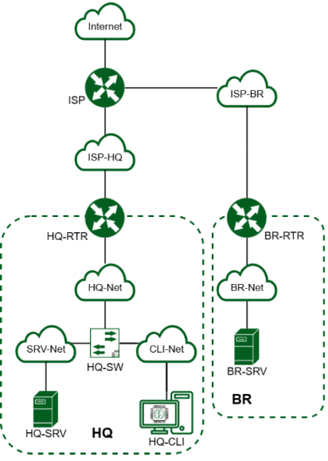
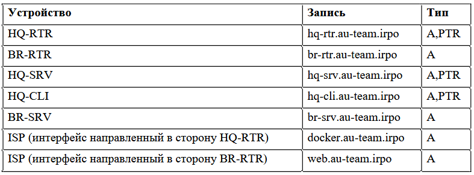

# **Лабораторная работа №14**
**Тема:** Настройка сети с нуля

## **Цель работы:**
Освоить практические навыки создания и настройки сети

## **ТОПОЛОГИЯ**

## **Ход работы:**

1. **Произведите базовую настройку устройств:**

    - Настройте имена устройств согласно топологии. Используйте полное доменное имя (DNS суффикс : au-team.irpo)
    - На всех устройствах необходимо сконфигурировать IPv4:
        - IP-адрес должен быть из приватного диапазона, в случае, если сеть локальная, согласно RFC1918
        - Локальная сеть в сторону HQ-SRV(VLAN 100) должна вмещать не более 32 адресов
        - Локальная сеть в сторону HQ-CLI(VLAN 200) должна вмещать не менее 16 адресов
        - Локальная сеть для управления(VLAN 999) должна вмещать не более 8 адресов
        - Локальная сеть в сторону BR-SRV должна вмещать не более 16 адресов
    - Настройте доступ к сети Интернет, на маршрутизаторе ISP:
        - Настройте адресацию на интерфейсах:
        - Интерфейс, подключенный к магистральному провайдеру, получает адрес по DHCP
        - Настройте маршрут по умолчанию, если это необходимо
        - Настройте интерфейс, в сторону HQ-RTR, интерфейс подключен к сети 172.16.1.0/28
        - Настройте интерфейс, в сторону BR-RTR, интерфейс подключен к сети 172.16.2.0/28
        - На ISP настройте динамическую сетевую трансляцию портов для доступа к сети Интернет HQ-RTR и BR-RTR
    - Создайте локальные учетные записи на серверах HQ-SRV и BR-SRV
        - Создайте пользователя sshuser
        - Пароль пользователя sshuser с паролем P@ssw0rd
        - Идентификатор пользователя 2026
        - Пользователь sshuser должен иметь возможность запускать sudo без ввода пароля
        - Создайте пользователя net_admin на маршрутизаторах HQ-RTR и BR-RTR
        - Пароль пользователя net_admin с паролем P@ssw0rd
        - При настройке ОС на базе Linux, запускать sudo без ввода пароля
        - При настройке ОС отличных от Linux пользователь должен обладать максимальными привилегиями.
    - Настройте коммутацию в сегменте HQ следующим образом:
        - Трафик HQ-SRV должен принадлежать VLAN 100
        - Трафик HQ-CLI должен принадлежать VLAN 200
        - Предусмотреть возможность передачи трафика управления в VLAN 999
        - Реализовать на HQ-RTR маршрутизацию трафика всех указанных VLAN с использованием одного сетевого адаптера ВМ/физического порта
    - Настройте безопасный удаленный доступ на серверах HQ-SRV и BR-SRV:
        - Для подключения используйте порт 2026
        - Разрешите подключения исключительно пользователю sshuser
        - Ограничьте количество попыток входа до двух
        - Настройте баннер «Authorized access only».
    - Обеспечьте динамическую маршрутизацию на маршрутизаторах HQ-RTR и BR-RTR: сети одного офиса должны быть доступны из другого офиса и наоборот.
        - Маршрутизаторы должны делиться маршрутами только друг с другом
    - Настройка динамической трансляции адресов маршрутизаторах HQ-RTR и BR-RTR:
        - Настройте динамическую трансляцию адресов для обоих офисов в сторону ISP, все устройства в офисах должны иметь доступ к сети Интернет
    - Настройте протокол динамической конфигурации хостов для сети в сторону HQ-CLI:
        - Настройте нужную подсеть
        - В качестве сервера DHCP выступает маршрутизатор HQ-RTR
        - Клиентом является машина HQ-CLI
        - Исключите из выдачи адрес маршрутизатора
        - Адрес шлюза по умолчанию – адрес маршрутизатора HQ-RTR
        - Адрес DNS-сервера для машины HQ-CLI – адрес сервера HQ-SRV
        - DNS-суффикс – au-team.irpo
    - Настройте инфраструктуру разрешения доменных имён для офисов HQ и BR:
        - Основной DNS-сервер реализован на HQ-SRV
        - Сервер должен обеспечивать разрешение имён в сетевые адресаустройств и обратно в соответствии с таблицей 
        - В качестве DNS сервера пересылки используйте любой общедоступный DNS сервер(77.88.8.7, 77.88.8.3 или другие)
        