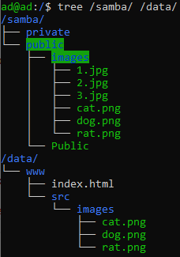
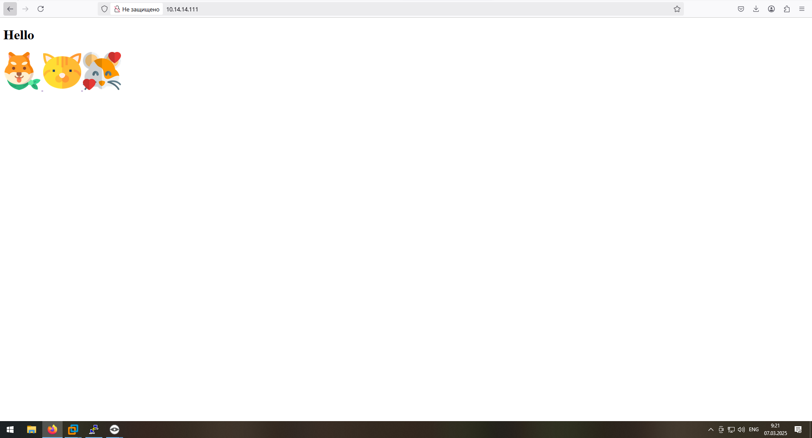
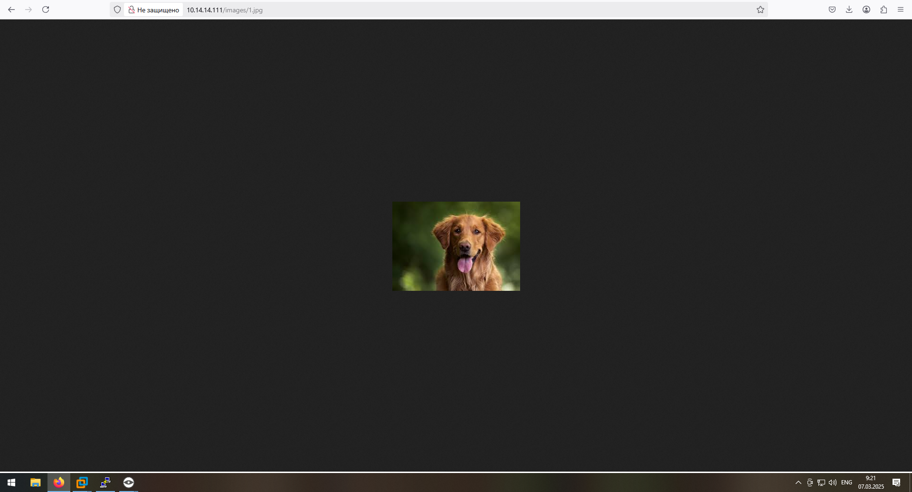

# Лабораторная работа №8
**Тема:** «Рассширенная работа с Nginx»  
**Цель:** Получить навыки работы и продвинутой настройки Nginx

### 1. Непосредственно перед установкой обновим данные репозитория, для этого введём в терминале:

```sh
apt update
```
## 2. Техническое задание

После выполнения работ связанных с установкой и настройкой Nginx и Samba вам необходимо проделать следующие действия перед выполнением текущей работы:

### 2.1. Скачать на сервер файлы расположенные тут ==> <a href="src/img/LB8/forlab">клик<a/>

### 2.2. Организовать следующие расположение файлов: 



## 3. Настройка nginx

С помощью документации расколоженной по ссылке ==> <a href="https://nginx.org/ru/docs/beginners_guide.html">клик<a/>  
Организовать следующие действия:  
При переходе на сайт у вас должна открываться страница расположенная по пути `/data/www`  
При дописывании `/images/` в ссылку у вас должна идти перессылка на файлы расположенных по пути `/samba/public`  
Если вы все выполнили верно, то у вас должно быть следующее:  

## 4. Главная страница



## 5. Страница по пути images



## 6.  Самостоятельно:

Загрузить три свои фотографии и открыть их на сайте  
Настроить еще одну директорию по которой будет открываться другая html страница 
